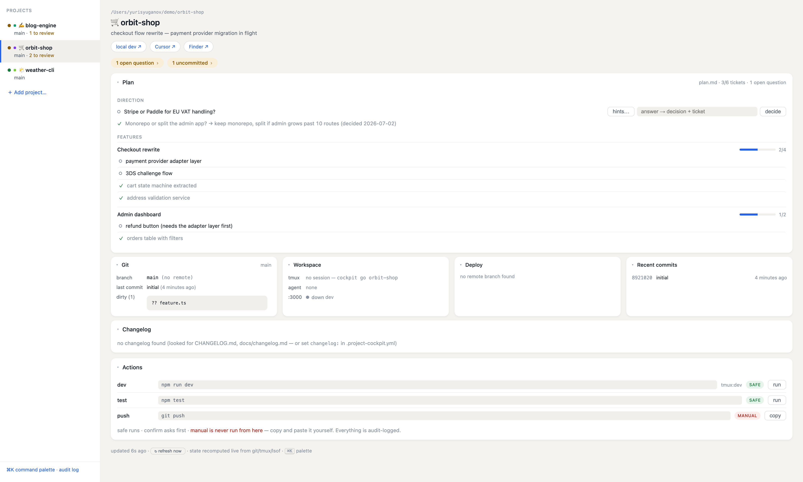
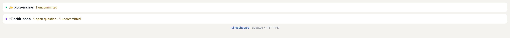

# cockpit

A local project cockpit: one CLI + dashboard for working on many AI-assisted projects at once — live status, named recoverable workspaces, tiered safe actions, agent visibility, and a per-project plan. Founding brief: [planning/project-cockpit.md](planning/project-cockpit.md).

One binary, five verbs, no daemon, no cache — every call recomputes live state from `git`, `tmux`, and `lsof`.



```
cockpit list                      all projects, one status line each (attention first)
cockpit status <project>          git, tmux, services, env files, actions
cockpit go <project>              attach-or-create the project's tmux session (dev/agent/shell)
                                  In iTerm2, uses tmux control mode by default: the session's
                                  windows appear as native macOS tabs (recommended iTerm2
                                  settings: General → tmux → open windows as "Tabs in a new
                                  window", and "bury the tmux client session").
                                  --no-cc forces the classic tmux UI; --cc forces control mode.
cockpit open <project> <target>   cursor | obsidian | finder | github | deploy | dev
cockpit run <project> <action>    run a declared action — tier-enforced, audit-logged
cockpit add [path]                register a project (default: cwd)
cockpit hooks [--install]         precise agent events via Claude Code hooks (opt-in)
cockpit audit                     print the audit log
cockpit dash [port]               dashboard at http://localhost:4400 (Phase 2)
```

## The mental model, in plain words

**What `<project>` means in commands:** the project's cockpit *name* — the first column of `cockpit list`. It was fixed when the project was registered: the `name:` from its `.project-cockpit.yml`, or the folder name if there is no config (so a folder `_WSET3_` can be named `wset3`). It is **not** your current directory — `cockpit go wset3` works from anywhere and always lands in wset3. A unique prefix is enough: `cockpit go modern`.

**What the three tabs are:** three empty, labeled command lines, all opened in the project folder — a desk with three labeled drawers, not three robots. Nothing runs in them by itself, and Claude cannot see or use the other tabs; it lives entirely in the tab where you started it.

- **dev** — you start the server here (`npm run dev`, or `cockpit run <p> dev` types it in for you)
- **agent** — you run `claude` (or `claude --continue` to resume a conversation) and talk to it
- **shell** — your drawer: `git push`, one-off commands

The tabs organize; they don't automate. The two exceptions where the *cockpit* does the typing: actions declared with `window:` are sent into their tmux tab, and the dashboard's "start implementation" opens a fourth `impl` tab with Claude already running. The payoff is uniformity: same three drawers in every project, and closing the window throws away nothing.

## Dashboard (Phase 2 + 3)

`cockpit dash` starts a web UI on `localhost:4400` and opens it in the browser: a project sidebar (needs-attention first) and per-project collapsible cards — Git, Workspace (tmux + ports), Deploy (date of the last push to origin's default branch — the "last PROD deploy" proxy for push-to-deploy projects), Recent commits, Changelog (auto-detected, or set `changelog:` in the repo config), and Actions. Light/dark follows the system. Refreshes every 10s; every request recomputes live state — stop and restart it freely, there is nothing to lose.

Phase 3 additions:

- **Actions run from the UI**, with the same tiers enforced *server-side*: `safe` runs on click (output shown inline, real exit code), `confirm` returns a 409 until the UI confirmation is acknowledged, `manual` is always refused (403) — the UI shows a copy button instead. Actions with `window:` are sent to the project's tmux window. Everything lands in the audit log tagged `[dash]`.
- **Open from the UI**: Cursor / Finder / Obsidian buttons (server-side `open`), web links for GitHub / deploy / local dev.
- **Command palette** (`⌘K`): switch project, open targets, run actions.
- **Audit log** view (sidebar footer).
- **＋ Add project** (sidebar): type a path (`~` works), or one-click a discovered candidate — the server scans the parent folders of registered projects for git repos not yet in the registry.
- The server binds `127.0.0.1` only and refuses cross-origin non-GET requests.

## Plan card (features · tickets · direction)

If a repo has a `plan.md` (root; or set `plan:` in the config), the dashboard renders it as the **Plan** card. Convention — plain markdown, readable everywhere:

- `## Direction` — checkbox questions about where the project should go; check when answered, keep the answer on the line
- `## Features` — one `### <feature>` block per epic, checkbox tickets under it

Rendering rules (the file is never reordered — checkboxes are the status): done tickets are struck through and sink within their feature; fully-done features are struck and sink to the bottom with a filled progress bar; open direction questions float to the top and raise an "N open questions" attention item.

**Deciding from the dashboard:** every open Direction question has an inline answer field. Submitting it (a) checks the question in `plan.md` and appends `→ <answer> (decided <date>)`, and (b) queues the work — the answer becomes a ticket under a `### Implementation queue` feature (created on first use). Two surgical line edits, audit-logged as `plan:answer`; refine the queued ticket into proper features later.

**Hints & generated options:** the `hints…` button on a question opens a popup showing any planning docs the question references (`planning/NN` is resolved against `<root>/planning/` and one level of subproject `planning/` dirs), plus a *generate options* button — a headless `claude -p` call (context inlined, no tools, ~15-60s) returns 3-5 grounded options with tradeoffs. Click to select one or more (the popup stays open; options are cached per question), then "use selected" combines them into the answer field. You still hit decide — selecting runs nothing.

**Work any ticket:** every open ticket in the Features list is a button — click, confirm, and an attended Claude Code session opens in the project's tmux `impl` window briefed with that specific ticket (it checks the box in plan.md when done; it never pushes). The Plan card sits at the top of the page: it is the per-project command center, not just a list.

**Start implementation:** after a decision is saved, the dashboard offers to start the work immediately: a new `impl` window in the project's tmux session running Claude Code, briefed with the decision and pointed at the Implementation-queue ticket. Attended, visible, interruptible — watch it with `cockpit go <project>`. Audit-logged as `plan:implement`. If you decline, nothing runs — the decision stays a queued ticket you can start any time (`cockpit go <project>`, then ask Claude in the agent tab to work the Implementation queue).

The foundation's docs rule tells Claude Code to keep the checkboxes current as it completes work, and the `plan.md` template ships with the base manifest. `cockpit status` shows a one-line summary.

The convention is a versioned spec — `docs/plan-md-spec.md` in the [ai-foundation] repo (this parser targets **v1.0**). The two projects stay separate but linked by contract: if a registered project carries a foundation install marker (`.ai/foundation-version.md`), the dashboard compares it with the foundation repo's current manifest and raises a "foundation vX → vY available" attention chip with audit/refresh commands; "Add project" offers the onboard command for repos that don't have the foundation yet. No foundation repo registered → all of this silently disappears.

## Agent visibility (Phase 4)

The cockpit detects Claude Code activity per project — best-effort, from two local traces: `claude` processes (matched to project roots by cwd) and session transcripts under `~/.claude/projects/` (mtime = last activity; the last message distinguishes a finished turn from a mid-turn stall, i.e. a likely permission prompt). States:

- **working ✳** — process present, transcript written in the last ~45s
- **waiting ✋** — process present, quiet: either "turn finished — waiting for your input" or "stalled mid-turn — possibly waiting for permission". Raises an `agent waiting for you` attention item.
- **idle** — process present, no activity for 30+ min
- **none** — no Claude Code process in that project

Shown in `cockpit list` (agent✳ / agent✋ column), `cockpit status`, the dashboard sidebar, and the Workspace card. Heuristic by design — it reads undocumented traces and is never load-bearing: the cockpit still only *observes* agents, never drives them.

**Waiting escalates with time.** A waiting agent shows its elapsed wait everywhere (`agent✋12m`, "needs you · 12m") and turns from amber to red past 10 minutes; needs-attention projects sort longest-waiting first. The dashboard also shows **what the agent last said** — the question or summary it left before going quiet — in the Workspace card, the waiting-chip popup, and `cockpit status`, so you can often decide from the dashboard whether it's worth switching context.

**Jump to the agent.** The waiting chip's popup (and `⌘K` → "jump to waiting agent") has a *jump to its terminal* button: the server selects the exact tmux window running `claude` (`tmux select-window`) and raises iTerm2. Focus only — it never types, sends, or starts anything. Same from the CLI: `cockpit go <project> -w agent` (or any window name).

**Precise events via hooks (opt-in).** `cockpit hooks --install` adds three Claude Code hooks (`Notification`, `Stop`, `UserPromptSubmit`) to `~/.claude/settings.json` — additive, existing hooks untouched, backup written, `cockpit hooks --uninstall` reverts. Each event appends one JSON line to `~/.project-cockpit/agent-events.log` (size-capped); `agentState()` prefers a fresh hook event over the heuristics, so "possibly waiting for permission" becomes the actual notification text (e.g. "Claude needs your permission to use Bash"). Hooks *report* — they never drive the agent. Without them everything above still works heuristically.

**Provider limit visibility (best-effort).** If recent transcripts show a Claude usage/rate-limit error, the dashboard shows a warning pill on the project header and warns before dispatching an implementation session (which would otherwise stall confusingly). Same undocumented-trace caveat as the rest of Phase 4; unreadable → the feature silently disappears.

## Focus view (`/focus`)

`http://localhost:4400/focus` is the attention-only slice of the dashboard: one row per project that needs you (accent dot, name, why, elapsed wait, a jump button for waiting agents) and literally nothing else — "all quiet" when nothing needs you. Sized for a narrow always-on-top browser window next to your editor, or a phone home-screen bookmark over Tailscale (same auth: the `?token=…` login URL works on `/focus` too). Same 10s live recompute as the main page.



## Per-project accent

Every project gets a stable accent color (hash of its name) shown as a small square in the dashboard sidebar, the `/focus` view, and `cockpit list`. Override with `color: "#7c3aed"` in `.project-cockpit.yml`; an optional `icon: "🚂"` prefixes the project name in the dashboard. Identity, not status — the semantic green/amber dots are unchanged.

## Install

Requires [bun](https://bun.sh) (runs the TypeScript directly — no build step) and tmux.

```bash
git clone https://github.com/earlyadopter/project-cockpit.git && cd project-cockpit && bun install && ln -sf "$PWD/bin/cockpit" ~/.local/bin/cockpit
```

Then register a project and go:

```bash
cockpit add ~/projects/my-app
cockpit dash             # dashboard at http://localhost:4400
cockpit dash --install   # optional: auto-start at login and self-restart (launchd)
```

`--install` writes `~/Library/LaunchAgents/com.project-cockpit.dash.plist` (RunAtLoad + KeepAlive, PATH including Homebrew/bun so tmux detection works; logs at `~/.project-cockpit/dash.log`). Remove with `cockpit dash --uninstall`. After a reboot the dashboard is simply there — but tmux sessions are not: recreate each with `cockpit go <project>`, and resume a project's Claude conversation with `claude --continue` in its agent tab.

## Remote access (phone / iPad)

By default the dashboard binds `127.0.0.1` and is unreachable from other devices. `cockpit dash --host <tailscale-ip>` binds it to your private [Tailscale](https://tailscale.com) network and enforces bearer-token auth on every request (token persisted at `~/.project-cockpit/token`; open the printed `?token=…` URL once on the phone and a 30-day cookie takes over). Full setup — including driving live agent sessions over SSH + tmux from an iPad — in [docs/remote-access.md](docs/remote-access.md). Never expose the dashboard to the raw internet.

## Data

- **Registry:** `~/.project-cockpit/registry.yml` — a list of project root paths. That's all the global state.
- **Per-repo config:** `.project-cockpit.yml` at the repo root (template: `foundation/templates/common/.project-cockpit.yml`). Optional — without it, cockpit degrades to git + tmux info with the folder name as the slug.
- **Audit log:** `~/.project-cockpit/audit.log` — append-only TSV: timestamp, project, action, tier, result.
- **Agent events:** `~/.project-cockpit/agent-events.log` — one JSON line per Claude Code hook event (only with `cockpit hooks --install`); size-capped signal buffer, not history.
- **Dashboard token:** `~/.project-cockpit/token` (0600) — bearer token for non-localhost binds, created on first `--host` use. Delete it to rotate.

## Safety tiers (enforced, not advisory)

- `safe` — runs immediately (still audit-logged)
- `confirm` — asks `y/N` first
- `manual` — **never executed**; prints the command (with `cd`) for you to copy-paste. Exit code 2.

Actions with a `window:` key are sent to that tmux window (e.g. long-running dev servers); others run inline in the project root and return the real exit code.

## Actionable attention chips

Every attention chip is a button. Clicking opens a popup that explains the situation and offers the safest available remedy: **auto-fix** where harmless (`pull --ff-only` behind-remote, create a missing config from template), **agent-fix** where judgment helps (uncommitted changes → an attended Claude session in a tmux `commit` window that groups and commits, never pushes), **copyable commands** where your safety model says manual-only (push, set-upstream), and **guidance** where it's genuinely your turn (agent waiting for you). All fixes are audit-logged (`fix:*`).

## Caveats

Built for one specific desk; know the assumptions before adopting:

- **macOS-only bits.** `cockpit open`/link buttons use macOS `open`; auto-start uses launchd (`~/Library/LaunchAgents`); "jump to agent" raises **iTerm2** specifically; `cockpit go` defaults to iTerm2 tmux control mode (`-CC`). The core (CLI status, dashboard, actions, plan card) is plain tmux + git and should travel, but no other platform is tested.
- **Agent detection is best-effort by design.** The heuristics read undocumented Claude Code traces (process cwd via `ps`/`lsof`, transcript files under `~/.claude/projects/`) that can change without notice. `cockpit hooks --install` upgrades accuracy via documented hook events, but states are advisory either way — never load-bearing. Only Claude Code is detected; other agents are invisible.
- **Trust model: single user, local machine.** The dashboard executes declared actions in your projects. It binds `127.0.0.1` by default, rejects cross-origin non-GET, and enforces a bearer token on any wider bind — but there is no multi-user story, no HTTPS, no sandboxing beyond the tier model. Tailscale is the only recommended remote path; never expose it to the raw internet.
- **tmux is the workspace model.** No tmux, no `go`/window actions/focus return — the status views still work.
- **Sessions don't survive reboots** (by design — the registry and audit log do). After a reboot, `cockpit go` recreates workspaces empty; resume Claude conversations with `claude --continue`.
